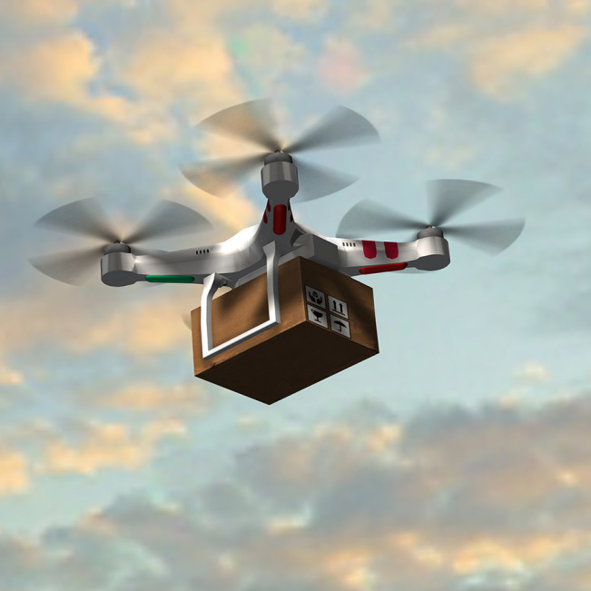

# DroneDrop

DroneDrop is a full-stack drone delivery system project. It features a Node.js/Express backend and a modern frontend for managing and tracking drone-based deliveries.

## Features
- User authentication and profile management
- Shop and cart system
- Checkout and order tracking
- Admin and user dashboards
- Responsive UI with Bootstrap

## Project Structure
```
LICENSE
README.md
.gitignore
drone_backend/        # Node.js/Express backend (API, models, routes)
drone_delivery_system/ # Frontend (HTML, CSS, JS, assets)
```

### Backend (`drone_backend/`)
- RESTful API for authentication, addresses, and more
- MongoDB models
- Vercel deployment config

### Frontend (`drone_delivery_system/`)
- Modular HTML components
- Modern CSS (Bootstrap, custom styles)
- JavaScript for interactivity (cart, shop, user, etc.)

## Getting Started

### Prerequisites
- Node.js (for backend)
- npm (for backend dependencies)

### Backend Setup
```bash
cd drone_backend
npm install
npm start
```

### Frontend Usage
Open `drone_delivery_system/pages/index.html` in your browser.

## Contributing
Pull requests are welcome! For major changes, please open an issue first to discuss what you would like to change.

## License
This project is licensed under the MIT License. See the `LICENSE` file for details.

---


